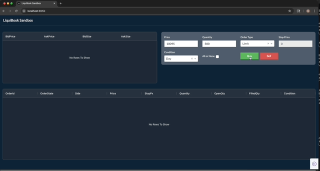

## Matching Engine - Liquibook

A Plotly/Dash web application that serves as a front end to the Liquibook matching engine, exposing the engine through Python bindings and enabling real-time order book visualization and interaction.

### Liquibook with Python Bindings
[https://github.com/mkipnis/liquibook](https://github.com/mkipnis/liquibook)

### DistributedATS
[https://github.com/mkipnis/DistributedATS](https://github.com/mkipnis/DistributedATS)



### To build:
```
python3 -m venv .venv
source .venv/bin/activate
python -m pip install --upgrade pip setuptools wheel
pip install -r requirements.txt
```

### To run from the Docker:
```
docker compose up -d --build
```
URL: http://127.0.0.1:8050
